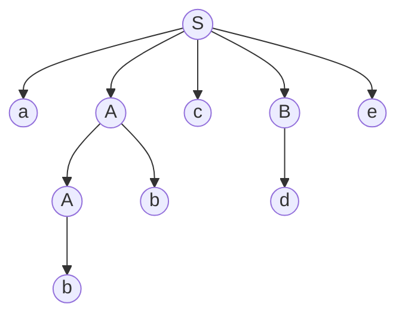
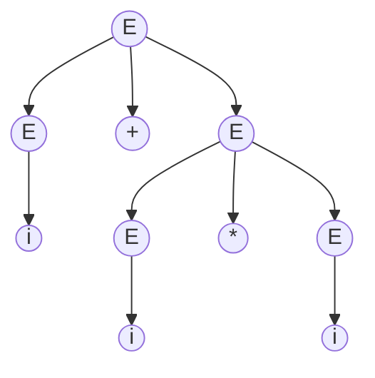
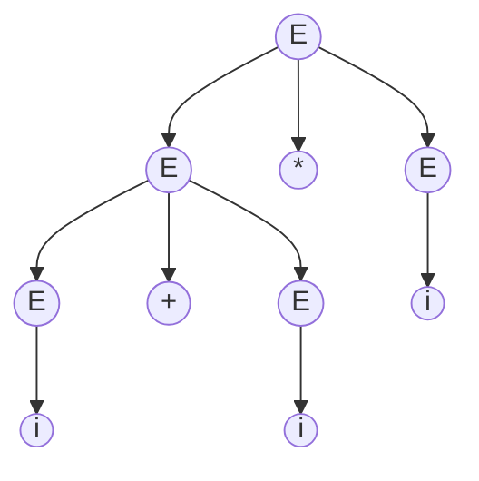
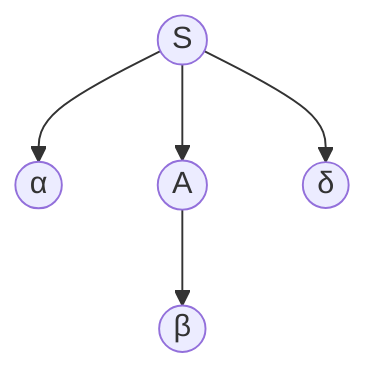
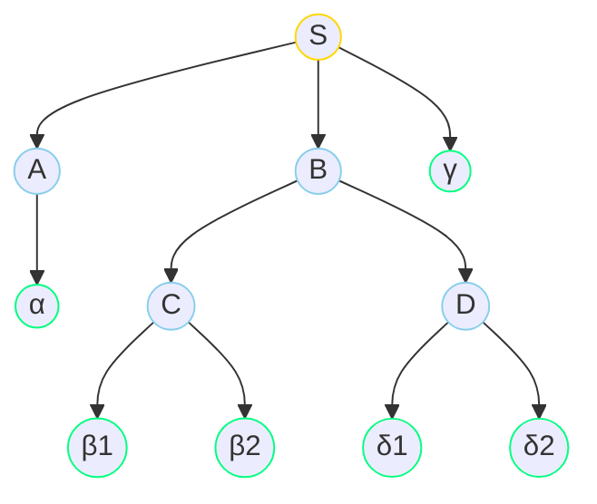
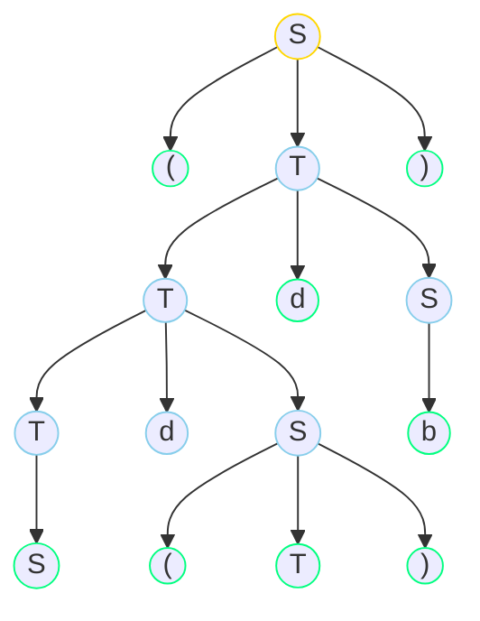

#### 移进归约冲突

**移进归约思想**：把输入符号一个一个地移进栈，当栈顶形成产生式候选时，即把栈顶部分归约为产生式的左部符号。

**移进归约分析**：

- $S → aAcBe$
- $A → b$
- $A → Ab$
- $B → d$

| 操作 | 元素 / 规则  | 栈                | 剩余输入    |
| ---: | :----------- | :---------------- | ----------- |
| - | - | $[]$ | $abbcde$ |
| 移进 |     $a$      | $[a]$             | $bbcde$     |
| 移进 |     $b$      | $[a, b]$          | $bcde$      |
| 归约 |   $A → b$   | $[a, A]$          | -           |
| 移进 |     $b$      | $[a, A, b]$       | $cde$       |
| 归约 |  $A → Ab$   | $[a, A]$          | -           |
| 移进 |     $c$      | $[a, A, c]$       | $de$        |
| 移进 |     $d$      | $[a, A, c, d]$    | $e$         |
| 归约 |   $B → d$   | $[a, A, c, B]$    | -           |
| 移进 |     $e$      | $[a, A, c, B, e]$ | $\emptyset$ |
| 归约 | $S → aAcBe$ | $[S]$             | -           |

**移进归约冲突**：

- $E → E+E {\ |\ } E*E {\ |\ } i$

| 操作 | 元素 / 规则  | 栈        | 剩余输入 |
| ---: | :----------- | :-------- | -------- |
|    - | -            | $[]$      | $i+i*i$  |
| 移进 | $i$          | $[i]$     | $+i*i$   |
| 归约 | $E→i$       | $[E]$     | -        |
| 移进 | $+$          | $[E,+]$   | $i*i$    |
| 移进 | $i$          | $[E,+,i]$ | $*i$     |
| 归约 | $E→i$       | $[E,+,E]$ | -        |
| 冲突 |              |           |          |

选择移进：

| 操作 | 元素 / 规则  | 栈            | 剩余输入    |
| ---: | :----------- | :------------ | ----------- |
| 移进 | $*$          | $[E,+,E,*]$   | $i$ |
| 移进 | $i$          | $[E,+,E,*,i]$ | $\emptyset$ |
| 归约 | $E→i$       | $[E,+,E,*,E]$ | - |
| 归约 | $E→E*E$     | $[E,+,E]$     | - |
| 归约 | $E→E+E$     | $[E]$         | - |

选择归约：

| 操作 | 元素 / 规则  | 栈            | 剩余输入    |
| ---: | :----------- | :------------ | ----------- |
| 归约 | $E→E+E$     | $[E]$         | - |
| 移进 | $*$          | $[E,*]$       | $i$ |
| 移进 | $i$          | $[E,*,i]$     | $\emptyset$ |
| 归约 | $E→i$       | $[E,*,E]$     | - |
| 归约 | $E→E*E$     | $[E]$         | - |

从上例可以发现，移进归约冲突的本质是运算符优先级选择的问题。

#### 短语

|                  概念 | 定义                                                         |
| --------------------: | :----------------------------------------------------------- |
|              **短语** | $β$是句型$αβδ$相对于非终结符$A$的**短语**。 任一子树所有叶结点组成的符号串都是该句型的**短语**。 **短语**是我们归约的目标。 |
|          **直接短语** | 如果有$A⇒β$，则称$β$是句型$αβδ$相对于$A→β$的**直接短语**。 **直接短语**所在的树只有一代。 |
|              **句柄** | 树最左边的**直接短语**。                                     |
|            **素短语** | 至少含有一个终结符 除它自身之外不再包含其它素短语。       |
|        **最左素短语** | 句型最左边的素短语。                                         |
| **规范归约/最左归约** | 每次归约都是对当前句型的**句柄**进行归约。 规范归约是**最右推导**的逆过程。 |
|          **规范句型** | 由**规范归约**推出的句型。                                   |

**例**：

句型$αβ_1β_2δ_1δ_2γ$的语法树如下：

- 短语：$α$、$β_1β_2$、$δ_1δ_2$、$β_1β_2δ_1δ_2$、$αβ_1β_2δ_1δ_2γ$
- 直接短语：$α$、$δ_1δ_2$、$β_1β_2δ_1δ_2$
- 句柄：$α$

**例**：

句型$(Sd(T)db)$的语法树如下：

- 短语：$S$、$(T)$、$Sd(T)$、$b$、$Sd(T)db$、$(Sd(T)db)$
- 直接短语：$S$、$(T)$、$b$
- 句柄：$S$

#### 算符优先文法

任意一个产生式右部不含两个相继（并列）的非终结符。则该文法称为**算符文法**。

如果一个**算符文法**中的任何终结符都至多只满足三种关系（$≮$、$≡$、$≯$）之一，则该文法称为**算符优先文法**。

通过$FIRSTVT$和$LASTVT$可以确定终结符的优先级。

- $FIRSTVT(P) = \{ a {\ \bold|\ } P⇒a\dots, {\ ||\ } P⇒Qa\dots, a∈V_T, Q∈V_N \}$
- $LASTVT(P) = \{ a {\ \bold|\ } P⇒\dots a, {\ ||\ } P⇒\dots aQ, a∈V_T, Q∈V_N \}$

**例**：

- $E → E+T ∣ T$
- $T → T∗F ∣ F$
- $F → (E) ∣ i$

|  $x$ | $FIRSTVT(x)$       | $LASTVT(x)$        |
| ---: | :----------------- | :----------------- |
|  $E$ | $+$、$*$、$($、$i$ | $+$、$*$、$)$、$i$ |
|  $T$ | $*$、$($、$i$      | $*$、$)$、$i$      |
|  $F$ | $($、$i$           | $)$、$i$           |

- $aQb$或$ab$，$a=b$：命中$(E)$

|      | $+$  | $*$  | $i$  | $($  | $)$  |
| :--: | :--: | :--: | :--: | :--: | :--: |
| $+$  |      |      |      |      |      |
| $*$  |      |      |      |      |      |
| $i$  |      |      |      |      |      |
| $($  |      |      |      |      | =    |
| $)$  |      |      |      |      |      |

- $aQ$，$a<FIRSTVT(Q)$：命中$+T$、$*F$、$(E$

|      | $+$  | $*$  | $i$  | $($  | $)$  |
| :--: | :--: | :--: | :--: | :--: | :--: |
| $+$  |      |  <   |  <   |  <   |      |
| $*$  |      |      |  <   |  <   |      |
| $i$  |      |      |      |      |      |
| $($  |  <   |  <   |  <   |  <   |  =   |
| $)$  |      |      |      |      |      |

- $Qa$，$LASTVT(Q)>a$：命中$E+$、$T*$、$E)$

|      | $+$  | $*$  | $i$  | $($  | $)$  |
| :--: | :--: | :--: | :--: | :--: | :--: |
| $+$  |  >   |  <   |  <   |  <   |  >   |
| $*$  |  >   |  >   |  <   |  <   |  >   |
| $i$  |  >   |  >   |      |      |  >   |
| $($  |  <   |  <   |  <   |  <   |  =   |
| $)$  |  >   |  >   |      |      |  >   |

#### LR(k)文法

|       | 说明                              |
| ----: | :-------------------------------- |
|   $L$ | 从左向右扫描输入                  |
|   $R$ | 最右推导对应的最左归约            |
| $(k)$ | 最多预看$k$个符号即可决定分析动作 |

**如何寻找句柄**：

- 根据历史信息：已移入符号栈的内容
- 根据展望信息：根据产生式推测未来可能遇到的输入符号
- 根据现实信息：当前输入符号

**LR分析法**：把历史及展望综合抽象成状态，由栈顶的状态和现行的输入符号唯一确定每一步工作。

- $action(s, a)$：当前状态$s$，输入符号$a$
  - $sn$：符号$a$入符号栈，状态$n$入状态栈
  - $rn$：用第$n$个产生式进行归约，符号栈弹出几个，状态栈弹出几个
  - $acc$：分析结束
- $goto(s, X)$：当状态$s$，面对文法$X$时，下一步的状态。
  - $goto(n)$：将状态$n$压入状态栈。

**例**：

- $(1): S → BB$
- $(2): B → aB$
- $(3): B → b$

@import "_lr_table.html"

| $s$  | $a$  | $action$  | $state\ stack$ | $symbol\ stack$ | 输入缓冲 |
| :--: | :--: | :-------: | :------------- | :-------------- | -------- |
|  -   |  -   |     -     | $[0]$          | $[]$            | $bab\#$  |
| $0$  | $b$  |   $s4$    | $[0, 4]$       | $[b]$           | $ab\#$   |
| $4$  | $a$  |   $r3$    | $[0]$          | $[B]$           | $ab\#$   |
| $0$  | $B$  | $goto(2)$ | $[0, 2]$       | -               | -        |
| $2$  | $a$  |   $s3$    | $[0, 2, 3]$    | $[B, a]$        | $b\#$    |
| $3$  | $b$  |   $s4$    | $[0, 2, 3, 4]$ | $[B, a, b]$     | $\#$     |
| $4$  | $\#$ |   $r3$    | $[0, 2, 3]$    | $[B, a, B]$     | $\#$     |
| $3$  | $B$  | $goto(6)$ | $[0, 2, 3, 6]$ | -               | -        |
| $6$  | $\#$ |   $r2$    | $[0, 2]$       | $[B, B]$        | $\#$     |
| $2$  | $B$  | $goto(5)$ | $[0, 2, 5]$    | -               | -        |
| $5$  | $\#$ |   $r1$    | $[0, 1]$       | $[S]$           | $\#$     |
| $1$  | $\#$ |   $acc$   | -              | -               | -        |

**LR文法**：对于一个文法，如果能构造一张分析表，使每个入口均是唯一确定的。LR文法一定是无二义的。
