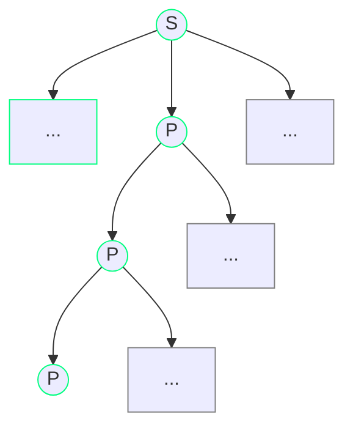
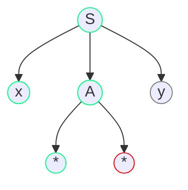
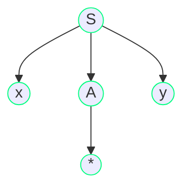
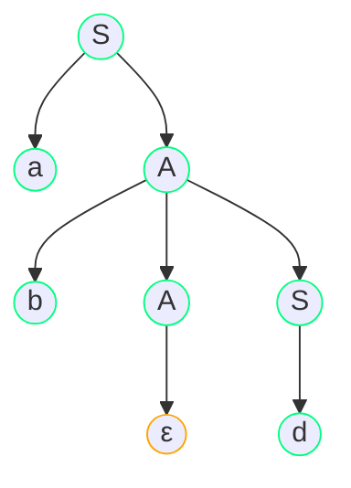
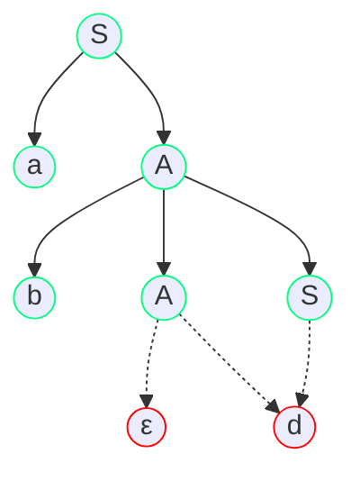

#### 左递归问题

**左递归产生**：

对于产生式$P → Pa$，可能产生：

**左递归消除**：

| 产生式                                                       | 处理                                                         | 说明           |
| :----------------------------------------------------------- | :----------------------------------------------------------- | :------------- |
| $P → Pα {\ \vert\ } β$                                       | $P → βP'$ $P'→αP' {\ \vert\ } ε$                          | 直接左递归改右递归 |
| $P → Pα_1 {\ \vert\ } \cdots {\ \vert\ } Pα_m {\ \vert\ } β_1 {\ \vert\ } \cdots {\ \vert\ } β_n$ | $P → β_1P' {\ \vert\ } \cdots {\ \vert\ } β_nP'$ $P' → α_1P' {\ \vert\ } \cdots {\ \vert\ } α_mP' {\ \vert\ } ε$ | 直接左递归改右递归 |
| $S → Qc {\ \vert\ } c$ $Q → Rb {\ \vert\ } b$ $R → Sa {\ \vert\ } a$ | $S → Sabc {\ \vert\ } abc {\ \vert\ } bc {\ \vert\ } c$ | 间接左递归代入改直接左递归 |

#### 回溯问题

**回溯产生**：

有产生式集合$\{ S → xAy, A → ** | * \}$，分析输入串$x * y$：

第1次试图匹配$**$失败

第2次试图匹配$*$成功

<!-- End Row Mermaid -->

**首符集**：

定义终结符首符集$FIRST(A)$为：

$$FIRST(A) = \{a {\ \bold|\ } A ⇒ a..., a∈V_T \}$$

若有$A⇒ε$，则规定$ε∈FIRST(A)$

**回溯避免**：

| 产生式                                                       | 限制 / 处理                                                  | 说明                                     |
| :----------------------------------------------------------- | :----------------------------------------------------------- | :--------------------------------------- |
| $A → a_1 {\ \vert\ } a_2 {\ \vert\ } \cdots {\ \vert\ } a_n$ | $FIRST(A_i) ∩ FIRST(A_j) = \emptyset$                        | $A$可以根据首符准确指派候选        |
| $A → δβ_1 {\ \vert\ } \cdots {\ \vert\ } δβ_n {\ \vert\ } γ_1 {\ \vert\ } \cdots {\ \vert\ } γ_m$ | $A → δA' {\ \vert\ } γ_1 {\ \vert\ } \cdots {\ \vert\ } γ_m$ $A' → β_1 {\ \vert\ } \cdots {\ \vert\ } β_n$ | 通过反复提取左因子 使首符集两两不相交 |

#### 候选式冲突问题

**后续集**：

$S$为文法开始符号，定义非终结符跟随集$FOLLOW(A)$为：

$$FOLLOW(A) = \{ a {\ \bold|\ } S ⇒ ...Aa..., a∈V_T \}$$

$FOLLOW(A)$为可能在某些句型中紧跟在$A$后边的终结符号集合。

**后续集的作用**：

- $S → aA$
- $S → d$
- $A → bAS$
- $A → ε$

$FIRST(S) = \{ a, d \}$、$FIRST(A) = \{ b, ε \}$、$FLLOW(A) = \{ a, d \}$

输入$abd$有：

在推出$A → ε$这一步，$d$不在$FIRST(A)$中，此时必须满足$d$在$FLLOW(A)$中

**候选冲突**：

- $S → aA$
- $S → d$
- $A → bAS$
- $A → d$
- $A → ε$

$FIRST(S) = \{ a, d \}$、$FIRST(A) = \{ b, d, ε \}$、$FLLOW(A) = \{ a, d \}$

输入$abd$有：

**冲突避免**：

当产生式含有$A → ε$时，应满足$FIRST(A) ∩ FLLOW(A) = \emptyset$。

#### LL(1)文法

**命名说明**：

|       | 说明                             |
| ----: | :------------------------------- |
|   $L$ | 从左向右扫描输入                 |
|   $L$ | 产生最左推导                     |
| $(1)$ | 最多预看一个符号即可决定分析动作 |

**文法要求**：

| 解决的问题 | 具体要求                                                     |
| ---------: | :----------------------------------------------------------- |
| 左递归问题 | 文法不含左递归                                               |
|   回溯问题 | 对于非终结符$A$的任意两个产生式$A_i$和$A_j$，若两者均不能直接推出$ε$，则应满足$FIRST(A_i) ∩ FIRST(A_j) = \emptyset$ |
| 候选是冲突 | 若存在$A → ε$，则$FIRST(A) ∩ FLLOW(A) = \emptyset$           |
