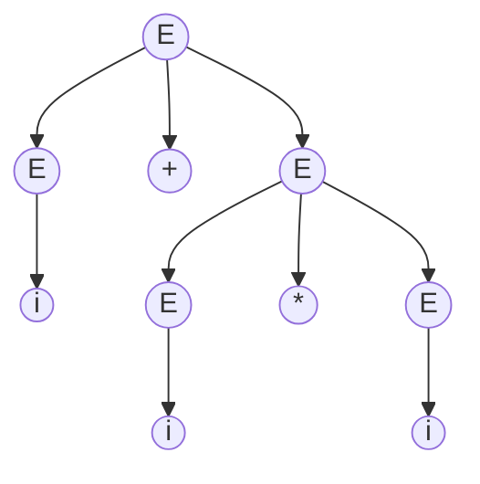
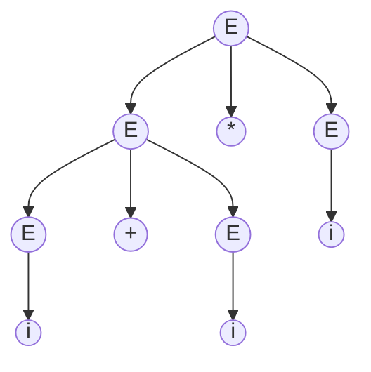

### 引论

>如果一个语言它不能影响你的编程思维的话，那么它不值得了解。

#### 语法与语义

|          | 说明                                                      |
| -------: | :-------------------------------------------------------- |
| **语法** | 一组规则，可以用于产生一个**合式**（well-formed）的程序。 |
| **语义** | 定义语法单位的意义。                                      |

语法规定了程序形式上的结构。语法规则包括词法规则和语法规则：

- **词法规则**：单词符号（常数、标识符、基本字、算符、界符）形成规则。
- **语法规则**：语法单位（表达式、语句、分程序、过程、函数、程序）形成规则。

|   例句   | 符合语法 | 符合语义 |
| :------: | :------: | :------: |
| 乌鸦喝水 |    √     |    √     |
| 水喝乌鸦 |    √     |    ×     |
| 乌鸦水喝 |    ×     |    ×     |

#### 相关定义

|                    概念 |      记作       | 定义                                  |
| ----------------------: | :-------------: | :------------------------------------ |
|                  字母表 |       $Σ$       | 一个有穷字母表                        |
|                    字符 |                 | $Σ$中的任意一个元素                   |
|      字 / 字符串 / 句子 |                 | $Σ$中的字符所构成的一个有穷序列       |
| 字的长度 / 字符串的长度 | $\vert{x}\vert$ | 字含有字符的个数                      |
|      空字 / 空串 / 空句 |       $ε$       | 不含任何字符的序列，$\vert{ε}\vert=0$ |
|                字的全体 |      $Σ^*$      | $Σ$上所有字的全体，包含空字$ε$        |

**例**：$Σ = \{ a, b \}$，$Σ^* = \{ ε, a, b, aa, ab, ba, bb, aaa, aab, \cdots \}$

#### 基本运算

定义$U$和$V$为$Σ^*$的子集：

|              运算              | 公式                                                         |
| :----------------------------: | :----------------------------------------------------------- |
|         并 *Union*          | $U {\ \vert\ } V = \{ x {\ \vert\ } x∈U {\ \|\ } x∈V \}$     |
|        积 *Product*         | $UV = \{ αβ {\ \vert\ } α∈U \And β∈V \}$                     |
|    $V$的$n$次积 *Power*     | $V^n = \begin{matrix} \underbrace{V \  V \cdots V} \\ ×n \end{matrix}$，规定$V^0 = \{ ε \}$ |
|  克林闭包 *Kleene Closure*  | $V^* = V^0 ∪ V^1 ∪ V^2 ∪ \cdots$                             |
| 正规闭包 *Positive Closure* | $V^+ = VV^*$                                                 |

**例**：$U = \{c, d\}$，$V = \{a, b\}$，则：

- $U {\ |\ } V = \{ a, b, c, d \}$
- $UV=\{ ca, cb, da, db \}$
- $VU=\{ ac, ad, bc, bd \}$
- $VV = V^2 = \{ aa, ab, ba, bb \}$
- $VVV = V^3 = \{ aaa, aab, aba, abb, baa, bab, bba, bbb \}$
- $V^* = \{ ε, a, b, aa, ab, ba, bb, aaa, aab, aba, abb, baa, bab, bba, bbb, \cdots \}$
- $V^+ = \{ a, b, aa, ab, ba, bb, aaa, aab, aba, abb, baa, bab, bba, bbb, \cdots \}$

**注**：闭包的其它角度理解

- `[a-z]*`：重复匹配任意小写字母$[0, +∞]$次。
- `[a-z]+`：重复匹配任意小写字母$[1, +∞]$次。

#### Chomsky文法体系

**产生式**：形如$α→β$的式子，读作$α$定义为$β$。

**终结符**：具体的字，比如数字、字母等。一般而言，**产生式**左侧不能仅含有终结符。

**非终结符**：抽象的字，必须通过推导产生式最终转换为终结符。

**文法定义**：

$$G=(V_T, V_N, S, P)$$

- $V_T$：终结符集合，$V_T≠\emptyset$
- $V_N$：非终结符集合，$V_N≠\emptyset \And V_T∩V_N≠\emptyset$
- $S$：文法开始符号，$S∈V_N$
- $P$：有限产生式集合

| 类型  | 文法类型                               | 识别机         | 产生式                                             | 限制                                                         |
| :---: | :-------------------------------------------: | :------------: | :----------------------------------------------------- | :----------------------------------------------------------- |
| $G_0$ | 短语结构文法 *Phrase structure grammar*    | 图灵机         | $α→β$                                                  | $α,β∈(V_T∪V_N)^*$ $α$至少有一个是非终结符                 |
| $G_1$ | 上下文有关文法 *Context sensitive grammar* | 线性有界自动机 | $α→β$                                                  | $α,β∈(V_T∪V_N)^*$ 除$S→ε$外，均满足$\vert{α}\vert≤\vert{β}\vert$ 产生式左边长度始终不大于右边 |
| $G_2$ | 上下文无关文法 *Context free grammar*      | 下推自动机     | $A→β$                                                  | $β∈(V_T∪V_N)^*$，$A∈V_N$ 产生式左边均为非终结符           |
| $G_3$ | 正规文法 *Regular grammar*                 | 有限状态自动机 | 右线性： $A→α$、$A→αB$ 左线性： $A→α$、$A→Bα$ | $α∈(V_T)^*$，$A,B∈V_N$ 产生式右边最多只有一个非终结符 产生式为推导停止或向右（左）扩展 保证左（右）侧始终为终结符 |

#### 文法的二义性

**最左推导**：任何一步$α⇒β$都是对$α$中的最左非终结符进行替换。

**最右推导/规范推导**：任何一步$α⇒β$都是对$α$中的最右非终结符进行替换。

**文法的二义性**：如果一个文法存在某个句子对应两棵不同的语法树，则说这个文法是二义的。

**例**：

由文法$E → E+E ⏐ E*E | i $，对于句子$i+i*i$可得最左推导：

$E ⇒ E+E ⇒ i+E ⇒ i+E*E ⇒ i+i*E ⇒ i+i*i$

$E ⇒ E*E ⇒ E+E*E ⇒ i+E*E ⇒ i+i*E ⇒ i+i*i$

#### 上下文无关文法与正规文法

上下文无关文法是比正规文法表达能力更强的文法。**正规文法中不允许出现递归定义**，因此不属于正规文法的上下文无关文法无法使用DFA或是NFA求解。
