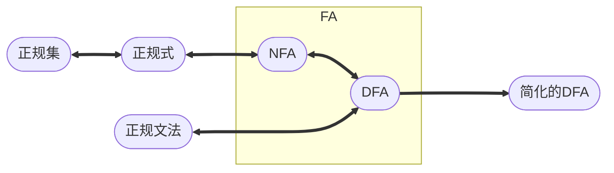
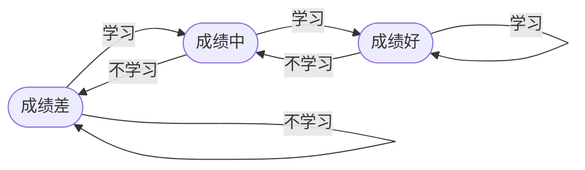
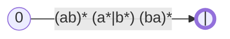
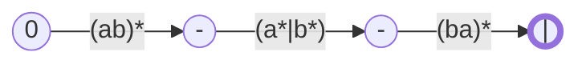
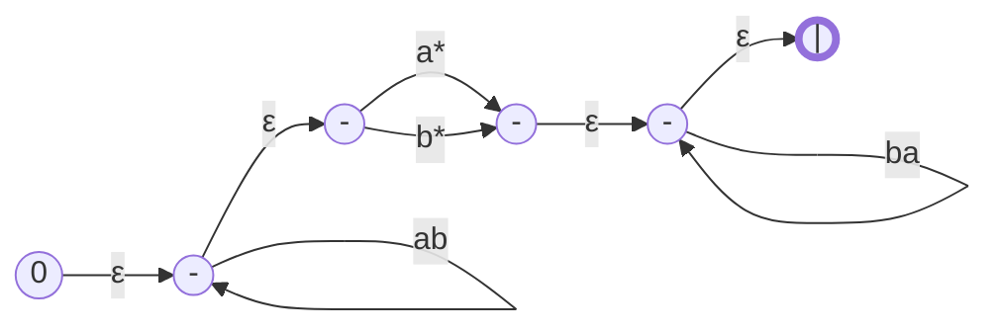
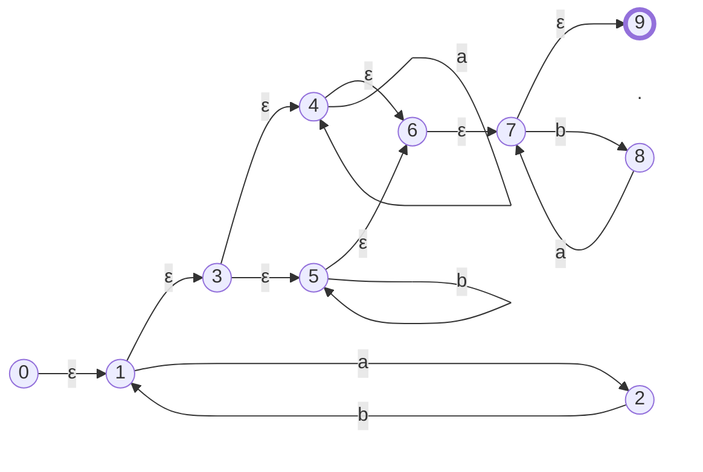

### 词法分析器

#### 正规集与正规表达式

**正规集**：能用**正规表达式**表示的集合。

**正规表达式**：表示**正规集**的一种方法。

**正规文法**：正规语言可用**正规文法**（一般较为复杂）表示也可用**正规表达式**表示，两者具有等价性。

|   正规式    |    正规集    |
| ----------------------: | :----------------- |
|      $ε$、$\emptyset$      | $\{ε\}$、$\emptyset$ |
|           $a$           |      $\{a\}$       |
|      $e_1$、$e_2$       | $L(e_1)$、$L(e_2)$ |
| $(e_1 {\ \vert\ } e_2)$ |  $L(e_1)∪L(e_2)$   |
|    $(e_1 \cdot e_2)$    |   $L(e_1)L(e_2)$   |
|        $(e_1)^*$        |    $(L(e_1))^*$    |

**正规式运算定律**：

- **交换律**：$e_1 {\ |\ } e_2 = e_2 {\ |\ } e_1$
- **结合律**：
  - $e_1 {\ |\ } (e_2 {\ |\ } e_3) = (e_1 {\ |\ } e_2) {\ |\ } e_3$
  - $e_1  (e_2  e_3) = (e_1 e_2) e_3$
- **分配律**：
  - $e_1 (e_2 {\ |\ } e_3) = e_1e_2 {\ |\ } e_1e_3$
  - $(e_2 {\ |\ } e_3) e_1 = e_2e_1 {\ |\ } e_3e_1$

**例**：

|                               正规式 | 正规集                               |
| -----------------------------------: | :----------------------------------- |
|                                  $a$ | $\{ a \}$                            |
|      $a {\ \vert\ } b {\ \vert\ } c$ | $\{ a, b, c \}$                      |
|                                $abc$ | $\{ abc \}$                          |
|                             $(ab)^*$ | $\{ a, b, aa, ab, ba, bb, \cdots \}$ |
|                 $(a {\ \vert\ } b)c$ | $\{ ac, bc \}$                       |
| $(a {\ \vert\ } b)(c {\ \vert\ } d)$ | $\{ ac, ad, bc, bd \}$               |

#### 确定有限状态自动机（DFA）

**DFA**易于程序设计，DFA可以由正规式或正规文法得到。

$$M = (S, Σ, f, S_0, F)$$

- $S$：有穷状态集
- $Σ$：有穷输入字母表
- $f(s,a) = s'$：状态转换函数，$s$为当前状态，$a∈Σ$，$s'$为下时刻状态
- $S_0$：初态，$S_0 ∈ S$
- $F$：终态，$F ⊆ S$，可以为空

**状态转换图**：含有$m$个状态、$n$个输入的DFA，可以用$m$个结点、每个结点至多含有$n$条射线出发的状态转换图表示。

**例**：学生学习成绩变好

- $S$：成绩好，成绩中，成绩差
- $Σ$：学习、不学习
- $f$：
  - 差`--学-->`中；差`--不学-->`差；
  - 中`--学-->`好；中`--不学-->`差；
  - 好`--学-->`好；好`--不学-->`中；

#### 非确定有限状态自动机（NFA）

**NFA**易于表达人的思想。DFA与NFA描述能力相同，是等价的。

$$M = (S, Σ, f, S_0, F)$$

- $f$：下时刻状态为一个集合或空
  - 同一个输入字可以出现在同状态射出的多条弧上
  - 弧上标记可以是一个正规式
- $S_0$：可以有多个初态

**转换规则**：

|                              转换前 | 转换后                                                       |
| ----------------------------------: | :----------------------------------------------------------- |
|              $i \xrightarrow{AB} j$ | $i \xrightarrow{A} k \xrightarrow{B} j$                      |
| $i \xrightarrow{A {\ \vert\ } B} j$ | $i \xrightarrow{A} j$ $i \xrightarrow{B} j$               |
|             $i \xrightarrow{A^*} j$ | $i \xrightarrow{ε} k \xrightarrow{ε} j$ $k \xrightarrow{A} k$ |

**例**：$(ab)^*(a^*|b^*)(ba)^*$

